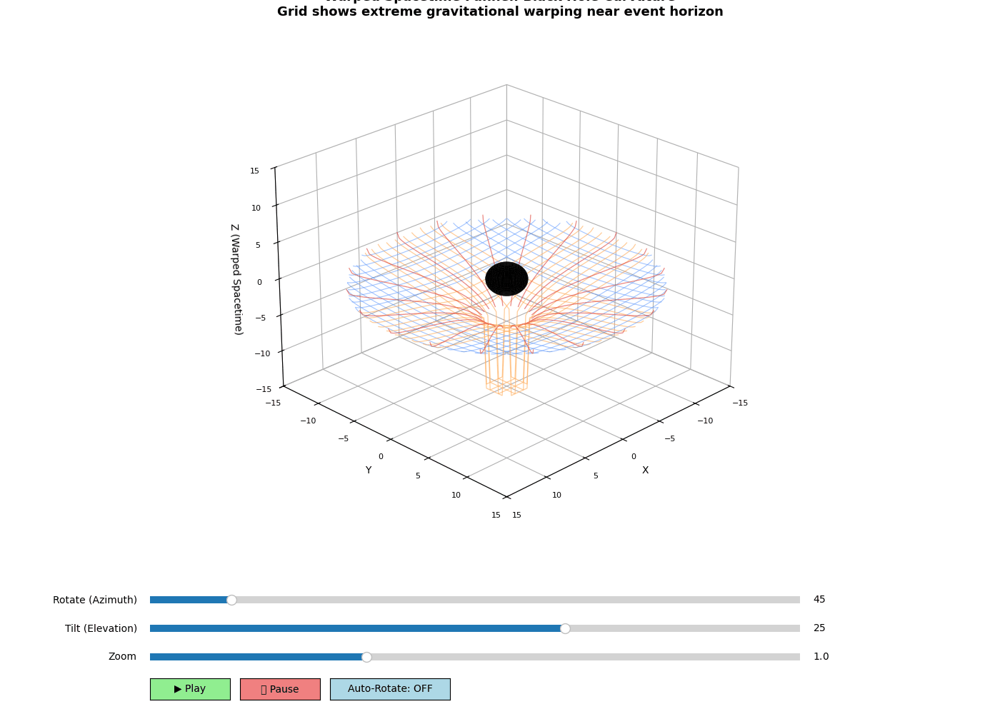

# Photon Sphere Studio 🌌

**3D Black Hole Visualization with Warped Spacetime Grid**

An interactive 3D visualization demonstrating photon geodesics (light ray paths) around a Schwarzschild black hole, featuring a dramatically warped spacetime grid and real-time animation controls.


---

## 📸 Visualization Preview

### 3D Warped Spacetime Funnel


*Interactive 3D funnel-shaped grid showing extreme spacetime curvature around a black hole. The grid warps dramatically inward near the event horizon, demonstrating how gravity curves spacetime itself.*


---

## ✨ Features

### 🎨 Realistic Physics Visualization
- **Funnel-Shaped Spacetime Grid**: 3D Cartesian grid that warps dramatically downward toward the black hole
- **Extreme Gravitational Curvature**: Deep gravity well (depth: -15 units at event horizon) showing black hole's intense spacetime warping
- **Schwarzschild-Inspired Warping**: Warp factor = -6.0 × √(rs/r) for realistic black hole curvature
- **Photon Geodesics**: Accurate 3D light ray paths calculated using general relativity equations
- **Event Horizon Visualization**: Black sphere representing the point of no return
- **Radial Grid Lines**: 20 radial lines emanating from center down the funnel showing gravitational pull

### 🎮 Interactive Controls
- **Rotation Slider (Azimuth)**: Rotate view 360° around the black hole
- **Tilt Slider (Elevation)**: Adjust vertical viewing angle from -90° to 90°
- **Zoom Slider**: Zoom in for details or out for full view (0.5x - 2.0x)
- **Play Button**: Start photon trajectory animation
- **Pause Button**: Stop animation
- **Auto-Rotate Toggle**: Enable automatic 360° camera rotation

### 🌈 Color-Coded Physics
- 🔴 **Red Grid Lines** (r < 4): Near event horizon - extreme curvature
- 🟠 **Orange Grid Lines** (4 < r < 7): Strong gravitational warping
- 🟡 **Yellow Grid Lines** (7 < r < 10): Medium distance - visible curvature
- 🔵 **Blue Grid Lines** (r > 10): Far from black hole - minimal warping
- 🟡 **Yellow Photon Rays**: Light rays that escape the black hole (deflected paths)
- 🟠 **Orange Photon Rays**: Critical scattering (looping near Photon Sphere)
- 🔴 **Red Photon Rays**: Light rays captured by the black hole (spiral inward)
- 🔵 **Cyan Sphere**: Photon Sphere (1.5x Schwarzschild Radius)
- ⚫ **Black Sphere**: Event horizon at Schwarzschild radius

### 🎨 Professional Design
- **Clean White Background**: Publication-quality visualization
- **Color-Optimized**: All elements optimized for visibility on white
- **Smooth Anti-Aliasing**: High-quality rendering
- **Distance-Based Coloring**: Intuitive color gradient showing gravity strength

### 💾 Export Options
- **Animated GIF Output**: Automatically saves animations (no ffmpeg required!)
- **High-Resolution Rendering**: Configurable DPI for publication-quality output

---

## 🚀 Installation

### Prerequisites
- Python 3.7 or higher
- pip package manager

### Install Dependencies

```bash
pip install -r requirements.txt
```

Or install packages individually:

```bash
pip install numpy matplotlib scipy pillow
```

---

## 💻 Usage

### Running the 3D Visualization

```bash
python Photon_Sphere_3D.py
```

**Features:**
- 3D warped spacetime funnel grid
- Extreme gravitational curvature visualization
- Interactive camera controls (rotate, tilt, zoom)
- Photon geodesic animation
- Saves as `photon_sphere_3d_full.gif`


---

## 🎯 Interactive Controls Guide

### 3D Visualization Controls

Once the 3D visualization window opens:

1. **Camera Controls** (Bottom sliders):
   - **Rotate (Azimuth)**: 0° - 360° horizontal rotation
   - **Tilt (Elevation)**: -90° to 90° vertical angle
   - **Zoom**: 0.5x (far) to 2.0x (close-up)

2. **Animation Controls** (Buttons):
   - **▶ Play**: Start photon trajectory animation
   - **⏸ Pause**: Pause animation
   - **Auto-Rotate**: Toggle automatic 360° camera rotation

3. **Mouse Interaction**:
   - Matplotlib's native 3D rotation (click and drag)
   - Works in combination with sliders

---

## 🔬 Physics & Mathematics

### Spacetime Warping

The visualization uses an **enhanced Schwarzschild-inspired warping function** to demonstrate extreme black hole curvature:

```python
warp_depth = -6.0 × √(rs / r) × (1 - r/r_max)^0.3
```

**At the event horizon**: depth = -15 units (very deep gravity well)

Where:
- `rs` = Schwarzschild radius (event horizon, rs = 2M)
- `r` = radial distance from black hole center  
- `r_max` = maximum grid extent (PLOT_LIMIT = 15.0)

This creates a **dramatic funnel-shaped gravity well**, showing that black holes create vastly stronger spacetime curvature than planets or stars. The grid warps **downward in the Z-direction**, forming a visible 3D funnel centered on the black hole.

### Schwarzschild Metric

The **Schwarzschild metric** describes spacetime around a non-rotating black hole:

```
ds² = -(1 - rs/r)c²dt² + (1 - rs/r)⁻¹dr² + r²dΩ²
```

**Event horizon** is located at:
```
rs = 2GM/c²
```

Where:
- `G` = gravitational constant
- `M` = black hole mass
- `c` = speed of light

### Photon Geodesics

Light rays follow **geodesic equations** in curved spacetime. The program numerically integrates:

```
d²u/dφ² + u = 3Mu²
```

Where `u = 1/r` and `φ` is the angular coordinate. This is solved using the **Runge-Kutta 4th order method** (`scipy.integrate.solve_ivp`).

**Impact Parameter**: Determines the trajectory:
- **Large b** (b > 3M): Light deflects but escapes
- **Small b** (b < 3M): Light captured or orbits
- **b = 3M**: Photon sphere (unstable circular orbit)

---

## 📊 Technical Details

### Key Components

#### `Photon_Sphere_3D.py` - 3D Funnel Visualization
- **Funnel Grid Generation**: Creates warped Cartesian grid (28 lines in X and Y directions)
- **Extreme Schwarzschild Warping**: Applies dramatic Z-displacement based on radial distance
- **Radial Grid Lines**: 20 radial lines showing gravitational pull toward center
- **3D Photon Trajectories**: Calculates geodesics in full 3D space with theta and phi angles
- **Interactive Controls**: Matplotlib sliders, buttons, and 3D view manipulation
- **GIF Animation Export**: PillowWriter for animated GIF output (no ffmpeg required!)
- **Color Gradient System**: Distance-based color mapping (red → orange → yellow → blue)

#### Grid Implementation Details
- **Grid Type**: Warped Cartesian (X-Y plane warping in Z direction)
- **Grid Lines**: 28 × 2 = 56 main grid lines + 20 radial lines
- **Resolution**: 100 points per grid line for smooth curves
- **Color Zones**: 4 distance-based color regions
- **Background**: White for publication quality

### Technologies Used

- **NumPy**: Numerical computations and array operations
- **Matplotlib**: 3D plotting, animation, and interactive widgets
- **SciPy**: Differential equation solving (ODE integration)
- **Pillow**: GIF animation export (no ffmpeg dependency!)

---

## 🎓 Educational Value

This visualization is ideal for:

- **Teaching General Relativity**: Visual demonstration of spacetime curvature
- **Understanding Black Holes**: See how extreme gravity warps space
- **Learning Differential Geometry**: Geodesics in curved spacetime
- **Studying Astrophysics**: Gravitational lensing and photon capture
- **Research Presentations**: High-quality, publication-ready visualizations

### Key Concepts Demonstrated

1. **Spacetime Curvature**: Grid visibly warps near massive objects
2. **Event Horizon**: The point of no return for light
3. **Photon Sphere**: Unstable orbit at r = 3M
4. **Gravitational Lensing**: Light bending around massive objects
5. **Geodesics**: "Straight" paths in curved spacetime

---

## 🎨 Visual Design

The visualization employs professional scientific visualization techniques:

- **Color Mapping**: Distance-based gradient (red → orange → yellow → blue)
- **Transparency Layers**: Alpha blending for depth perception
- **Smooth Curves**: Anti-aliased rendering for visual quality
- **Clean Background**: White background for publication quality
- **Dynamic Lighting**: Shaded surfaces on 3D objects
- **Grid Hierarchy**: Multiple line weights for visual clarity

---

## 🤝 Contributing

Contributions are welcome! Areas for enhancement:

- **Kerr Metric**: Add rotating black hole spacetime
- **Multiple Black Holes**: Binary black hole systems
- **Ergosphere**: Visualization for rotating black holes
- **Ray Tracing**: Full raytraced rendering
- **VR Support**: Virtual reality interface
- **Real Data**: Integration with actual black hole observations

Feel free to:
- Report bugs via GitHub Issues
- Suggest new features
- Submit pull requests
- Improve documentation

---

## 📝 License

This project is licensed under the **MIT License** - see the [LICENSE](LICENSE) file for details.

---

## 🙏 Acknowledgments

- **Albert Einstein**: General Theory of Relativity (1915)
- **Karl Schwarzschild**: Schwarzschild solution (1916)
- **Event Horizon Telescope**: First black hole image (M87*, 2019)
- **Matplotlib Development Team**: Excellent 3D visualization tools
- **SciPy Contributors**: Robust numerical integration methods

---

## 📧 Contact & Support

- **Issues**: Open an issue on GitHub
- **Discussions**: Use GitHub Discussions for questions
- **Documentation**: See code docstrings for implementation details

---

## 🌟 Gallery

### Photon Trajectories
The yellow and red rays show how light bends around the black hole:
- **Yellow rays**: Deflected but escape to infinity
- **Red rays**: Captured by the black hole's gravity

### Spacetime Grid
The funnel-shaped grid demonstrates:
- Space itself is curved by mass
- Stronger curvature closer to the event horizon
- Black holes create extreme warping (much more than stars)

---

**Explore the fascinating physics of black holes and general relativity! 🌌✨**

*"Spacetime tells matter how to move; matter tells spacetime how to curve."* - John Archibald Wheeler
